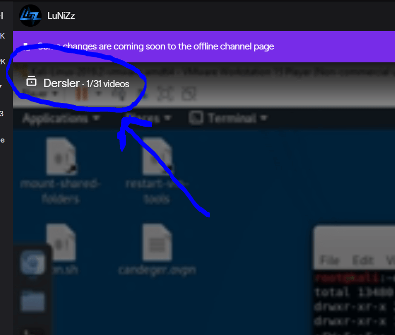
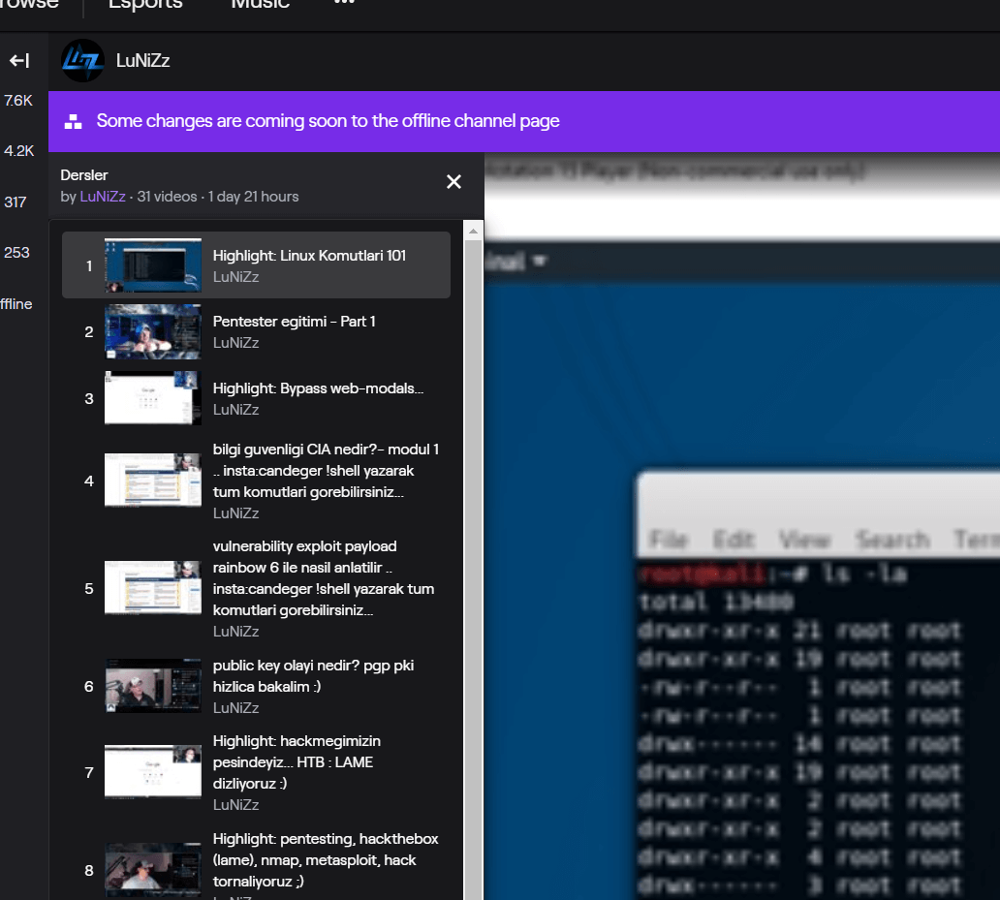

<!--Satırların sonundaki "\" işareti bir alt satıra geçirmek için kullanılıyor. Kullanmazsanız linkler birbirine girebilir. -->
## LuNiZz linkleri

- TWITCH YAYINLARI : 
Tüm geçmiş yayınlar : https://www.twitch.tv/lunizz/videos (Buradaki yayın geçmişleri ve tüm yayınlar bedava dostlar...)

***Yayınlar SALI - PERŞEMBE - PAZAR günleri saat 20.00'de*** 

- Discord: 
- Twitter: 
- Youtube: https://youtube.com/candeger
- Instagram: https://instagram.com/candeger

 ***Team luNiZzers Uyeleri*** https://www.twitch.tv/team/lunizzers
- Sharky           : 
- Nirrein          : 
- Felixed          : 
- Bloodmane        : 

***Bu kaynağı nasıl kullanacağını bilmiyor musun? Nereden başlamalıyım diye düşünmekten hiçbir şeye başlayamıyor musun? İşte bu yayını tam da senin için yaptık! Git bir bak bence >>> https://www.twitch.tv/videos/634645006 ya da hızlandırılmış, daha özet olan Youtube versiyonu için burayı ziyaret edebilirsin >>> https://www.youtube.com/watch?v=qbaBr8rXwaE   

Selamlar, burayı bulduğuna göre siber güvenliğe ve alt dallarına merakın var demektir. O zaman hoşgeldin. Bizler, genel olarak siber güvenlik kariyerinde ilerlemek isteyen arkadaşlara yol göstermeyi, iyi ve doğru bir başlangıç yapmalarına yardımcı olarak, onları doğru yerlere yönlendirmeyi hedefleyen bir topluluğuz. Bana ve arkadaşlarıma yukarıda gördüğün adreslerden kolaylıkla ulaşabilirsin. 
Ayrıca yaptığımız yayınlara gelip göz atabilirsin...

Aşağıda bana sıkça sorulmuş sorulara bir göz atarak başlamanı öneririm, onun altında kapalı menüler halinde birçok kaynak var, her birine bir göz at.

* Özellikle *KURSLAR, ÇEŞİTLİ KAYNAKLAR, TAKİP EDİLESİ YOUTUBE KANALLARI* başlıklarında bulunan bilgiler bir çok soruna cevap olabilir.

Ayrıca yayın geçmişinde yer alan videoların toplu playlist hali de bulunuyor, linkler arasında ve görsel olarak nasıl izleyebileceğini anlattım.

*"Hacking The TEMEL"* https://www.twitch.tv/collections/sHv1c2HZEhaHFQ << video serisi bu iş için başlangıç konularını irdeliyor, eğer yeni başladıysan ona özellikle göz atmanı tavsiye ederim... (mouse'u videonun sol üst köşesine getirirsen diğer bütün videolar listeleniyor)

Aramıza hoş geldin ve görüşürüz!

-LuNiZz    
---

### Nereden başlamalıyım?
İşte tam bununla ilgili bir yayın yaptık biz :) https://www.twitch.tv/videos/634645006 ama şu anda bulunduğun site, yukarıdaki linkler, aşağıdaki metinler zaten nasıl ilerleyeceğini sana anlatmak için var. 

Unutmadan en temel eğitim playlist i olarak, Cyber Mentor'un Ücretsiz şu YouTube videolarını sömür ;)
https://www.youtube.com/playlist?list=PLLKT__MCUeiwBa7d7F_vN1GUwz_2TmVQj

### Hangi bilgisayarı almalıyım hem yazılım hem siber güvenlik ve benzeri konular için?
Şimdi dostum, yazılım veya siber güvenlik demek, günlük hayatında yoğun olarak, bol bol makale okumanı video izlemeni gerektirecek, onun dışında sanal makina çalıştırman gerekecek, ve iyi bir network bağlantısına ihtiyacın olacak...

Bunlar için eskiden dizüstü bilgisayarların dezavantajları vardı ancak bugün masaüstü veya dizüstü pek farketmiyor, hatta dizüstü daha avantajlı.

Bu noktada kişisel tercihler ön plana çıkıyor;
bence bir bilgisayarın;
1) hafif olmalı, gittiğin her yere rahatlıkla götürebilmelisin, bu noktada laptop daha avantajlı, mesela Starbucks'da otururken de makale okuyabilirsin ;)
2) işlemcin en az i5 seviyesinde ve maksimum 2 jenerasyon eski olmalı, şu an itibariyle konuşursak (10. gen en yenisi) 8 olmalı...
3) RAM en önemli bileşenin, en az 8 GB RAMin olmalı, sanal makina 1 tane çalıştırabilirsin adam gibi bu durumda, o yüzden 16 GB olursa çok daha rahat olur. En azından "victim" makine de çalıştırabilirsin.
4) HDD kesinlikle SSD olmalı, bu desktop ile laptop in en büyük fark idi eskiden, çünkü ssd oncesinde laptop diskleri 6000 kusur RPM'di çok yavaştı adamı sinir ediyordu, ama bugün laptoplarda SSD kullandığı için süper oldular... Sende o yüzden SSD tercih etmelisin...

bunlarin dışında, e insanız birazda oyun oynayacaz dersen, hani paylaşımsız herhangi bir ekran karti bayağı bir işini görür. Eskiden şifre kırmak için falan GPU kullanıyorduk da şimdi o işler için web siteleri var onları kullanıyoruz ;) pek lokal de yapmıyoruz o işleri... O yuzden çok önemli değil...

Ha laptop seçerken dikkat etmen gereken önemli bir unsur da, Linux uyumluluk, seçtiğin modele ilerde Native Linux yüklemek isteyebilirsin... O zaman driverlarının vs sorun çıkarmaması için, ürünü bir arat Google'dan. Ha dersin ki işim olmaz ben VM/Vbox takılacam, tamamdır o zaman farketmiyor...

böyle...

### Abi selam, XX yaşındayım sence geç kalmış olabilir miyim?
Sevgili dostum, teknoloji ile ilgili konularda hiçbir şey için geç kalmış olmazsın, ben 40 yaşından sonra SEO, Youtube, Twitch'ten yayın yapma olayını öğrendim :) Digital Marketing olayını, video editing olayını çözdüm... Önemli olan, methodu bilmen, araştırma yapabilmen, bilgiye nasıl kolayca ulaşılabileceğini bilmen...

###  Algoritmayı ve kod yazmayı ücretsiz nasıl öğreniriz?
Algoritma mantığını öğrenmek için https://www.hackerrank.com/ biçilmiş bir kaftan. Gene kod yazmanın mantığını anlamak için https://edabit.com/ önerebileceğim bir site. Algoritmaya yönelik gene https://www.codewars.com/ var. Ve sıfırdan başlamak için https://www.freecodecamp.org/. Eger üniversiteye gidiyorsanız Github Education Pack ücretsiz olarak alabilir ve birçok ürün ve eğitime bedava erişebilirsiniz(domain, hosting dahil) https://education.github.com/pack .

###

### Programlama geçmişim var, hangi CyberSecurity dalını seçmeliyim? 
En hızlı çözüm, büyük olasılıkla *OWASP* ve benzeri kurumlara bakarak, Application Pentester'lık veya Security Researcher'lık olacaktır. Hem hızlıca para kazanmanı da sağlar. BugCrowd ve Hackerone'ın eğitim sitelerine girip, bu firmaların bug bounty programlarına kayıt olarak para kazanmaya başlayabilirsin.

Tüm siber güvenlik dallarını şurada inceledim, bir bak: https://github.com/LuNiZz/siber-guvenlik-sss/blob/master/siberguvenlik.md 

### Abi Udemy'de/hedehodode/XYZde ıvırda zıvırda, TÜRKÇE bir eğitim buldum, Nasıl?
Sevgili dostum, Udemy de özellikle sevgili Atıl Samancıoğlu, Ahmet Birkan, Ebubekir Bastama, Cemal Taner... vs gibi birçok kişinin egitimlerini bulabilirsin, eğitimin iyisi kötüsü olmaz. Sen bilginin isine yarayan kısmını al... Yanlış olduğunu eksik olduğunu düşündüğün alanlarını araştır ve kendini geliştirmeye devam et.
Kişisel olarak benim herhangi bir Udemy Türkce içeriğine tavsiye veya öneride bulunmam ne yazık ki mümkün değil, cünkü o eğitimlerin hiçbirini alıp, incelemedim. İncelemeyi de düşünmüyorum. Duyduğum yorumlar genel olarak, Udemy'deki değerlendirme ve yorumlarla aynı şekilde, o sebeple incele oku. Kararını kendin ver.
Ben özel olarak bir yorum veya tavsiyede bulunanamam.

Dersen ki İngilizce kaynak lazım bana, o zaman az aşağıda "The Cyber Mentor" un ücretli eğitimleri var, zaman zaman Twitter ve LinkedIn'den bunların indirim ve benzeri kodlarını yayınlıyor, gözat istersen.

### Nasıl kendimi hack saldırılarından korurum? 

Kişisel güvenlik için İngilizce bir checklist var burada, bir bak... Bütün önemli konuları kapsıyor... https://github.com/LuNiZz/personal-security-checklist

### Web uygulama güvenliği için iyi bir kaynak biliyor musun?
Sitenin alt kısmındaki kaynaklar oldukça iyi, *portswigger academy* olsun, *hacker101* olsun, *bugcrowd academy* olsun çok başarılı, bunların dışında mutlaka *OWASP*'a da bir göz at, hatta *TryHackMe*'nin *OWASP 10* odasına; https://tryhackme.com/room/owasptop10 
https://tryhackme.com/room/rpburpsuite << burp suite odasına,  
https://tryhackme.com/room/learnowaspzap << owasp zap odasına,   
https://tryhackme.com/room/webfundamentals << web fundementals odasına,   
https://tryhackme.com/room/webappsec101 << webappsec101 odasına,  
ve ardından kendini test etmek için;   
https://tryhackme.com/room/vulnversity   
https://tryhackme.com/room/juiceshop   
https://tryhackme.com/room/rpwebscanning   
https://tryhackme.com/room/dvwa   
https://tryhackme.com/room/jack  
odalarına bakabilirsin, 

Ayrıca aşağıdakiler de çok iyi...

#### MDISEC (Mehmet D. Ince) Web ve uygulama güvenliği yayınları >>> https://github.com/mdisec/mdisec-twitch-yayinlari

BWAPP ile buglu bir sitede BugBounty alıştırması yapabilirsiniz:
http://www.itsecgames.com/
   

### Üniversite okumalı mıyım?  
Şahsen ben kendi yaşadıklarımdan üniversitenin gerekli olduğu sonucuna ulaştım. O nedenle bir 4 yıllık okul önemli. Mühendislik olursa iyi olur ama olmazsa da çok dert değil. Önemli olan sizin yarattığınız fark ve değer. Üniversitesiz de bu işi yapanlar var tabii ama çok zor, çok uğraştırır... Bak şurada açıklamışım, izle bi': https://www.youtube.com/watch?v=eguWGnlJN-Q 

### X bilimleri vs Y Muhendisligi vs Z tornacılığı ya da siber güvenlik mühendislik uzmanlığı profesorlüğü bölümü? Hangisini seçersem "siberci" olurum?
E) Hepsi. 
Olay sende bitiyor dostum, kendini nasıl geliştirip, katma değer üretirsen o şekilde ilerlersin.

### Ben eğitimlerimi tamamladım, bu siteyi de yaladım yuttum, artık her türlü Pentesting, Web App Testing, Siber Güvenlik konularına hakim olduğumu düşünüyorum. Peki şimdi ne yapmalıyım?
O zaman sevgili kardeşim, kendine bir açık kaynak kodlu proje bul ve ona Pull Request at. Projeyi geliştir, adını duyur, bunları yapman ileride staj ararken ve iş basvurusunda bulunurken senin için cok ama cok fayda sağlayacak. Bunu sakın atlama.

### Hangi programlama dillerine ve teknolojilerine eğilmeliyim?
Bu konuda birçok kaynak var aslında: *Python*, *JavaScript*, *C/C++*, *Bash Scripting*(Linux komut satırı), sanal makinede Kali Linux çalıştırabilmek, temel CCNA ile network bilgisi SQL hakkında fikir sahibi olmak. Başlangıç için bunlar oldukça işine yarayacaktır.

### Abi İngilizcem yok! Ne yapıcam?  
İngilizce öğreneceksin dostum, başka yolu yok bu işin. Hemen elindeki bütün işi bırakıp, okuduğunu anlayacak seviyede İngilizce öğrenmen lazım. Duolingo vs. gibi İngilizce öğreten kaynakları ye, yut, bitir. Ayrıca dizi, film ile de İngilizce öğrenebilirsin.. (Ororo Tv, Dizilab vs. biliyorsun işte bunları nereden bulacağını) \
Şöyle bir şey de var: https://www.voscreen.com/ \
İzlediğiniz dizilerde geçen kelimelerin anlamını öğrenebileceğiniz şöyle bir site de var : https://diziyleogren.com/tanitim 

### Siber güvenlik ile değil de, yazılım ile ilgilenmek istiyorum. Hangi alanlara bakayım?
Gelişmekte olan teknolojilere bakmak lazım: DevOps, full stack development, mobil programlama, web application development vs. önemli konular. Tabii ki oyun geliştirme de keyifli olabilir, ancak ben konunun uzmanı değilim ve bu konular geçmişinle doğru orantılı olarak farklılık gösterebilir, bunu en iyisi yayında tartışalım. 

### Oyun geliştirme konusu da çok ilgimi çekiyor, siber güvenlik de. Ne yapacağım? Hangisini seçmeliyim?
İkisi de farklı konular tabii ki ancak, benim yaptığımı niye denemiyorsun? Oyun geliştirme firmasında siber güvenlikçi ol. Mesela ben, Danimarka'daki Unity genel merkezinde IT Security Architect olarak çalışmıştım. Bence keyifli olabilir, boş vakitlerinde de oyun geliştirirsin. 

### Abi Instagram'dan sana sordum, görmedin. O nedir abi, bu nedir abi? Ivır nedir abi? Zıvır nedir abi?  
Sevgili kardeşim, her ne kadar yardımcı olmak istesem de Instagram soru cevaplamak için iğrenç bir platform. Çok detaylı teknik sorularınızdan ziyade, bir yön gösterip, siz gerekli araştırmaları yaptıktan sonra takıldığınız yerde bana geldiğinizde çok daha rahat yardımcı olabilirim. Konu çok derin, uygulama dandik, vakit sınırlı... En yüksek faydayı sağlayabilmek için senin de biraz araştırma yapman lazım. Hem araştırma yapabilmek bizim işimizin en önemli parçası. Biraz söylediğim alanlarda araştırmalarınızı yapın, sonra gelin sorularınıza göre yeniden yön çizelim. *Ben Google değilim!* Yaptığımız şey mentorluk. Herkese ulaşabilmek için size de düşen birkaç görev var yani. Yardımınız için teşekkürler.

Bak bir de burada sormaman gereken sorular var :) : https://www.youtube.com/watch?v=fLV0y0Dn0Ug

### Abi bulunduğum şehirde devletin, İşkur'un veya benzer kurumların bilişim kursları var. BTK'nın eğitim kursları falan var, 1M yazılımcı vs. diye, Bunlara gideyim mi? İşe yarar mı?  
Yarar kardeşim. Hiçbir şey olmazsa temel olur. Bilgiden zarar gelmez. Temeli alın sonra İngilizce'nizi ilerletin. Ondan sonra da internetteki ücretsiz kaynaklara yönelin. Aklıma geldi, bu yaz kampları vs. var, birçok firma düzenliyor, bir de özgür yazılım için vs. için de var bazı dernekler yapıyor... Onlara da katılabilirsiniz bayağı faydalılar. 

Türkçe kaynak olarak https://bilgeis.net/tr var, yine ucretsiz olan.

### Abi pentesting hadisesine ilgi duyuyorum da nasıl kendimi test edicem, bir şeyleri kırmadan dökmeden?  
*Kali Linux* indirdin mi? süper! O zaman şuraya gidiyorsun => https://www.hackthebox.eu/ \
Oraya join dediğinde invite kodu gir diyecek. İşte o kodu, o siteden kazıyarak çıkartman gerek. Ya da ben bu işlere hazır değilim diyorsan şu adreslerdeki örnekleri kullanarak kendine bir kod yaratabilirsin => \
https://medium.com/@sonusaikishan/hackthebox-how-to-get-the-invite-code-and-enter-into-hackthebox-eu-fb4f3f24dc6c \
https://codeburst.io/hack-the-box-how-to-get-invite-code-56e369fc8dae \
https://www.youtube.com/watch?v=uZtC_ZqwzTE \
İçeriye girince de aktif bilgisayarlardan istediğin ile test yapmaya başlayabilirsin. 

Ayrıca TryHackMe var mesela: https://tryhackme.com buranın eğitim serisi çok iyi...
Bir de şimdi HackTheBox pwnbox diye bir özellik getirdi, VIP'lerine hazır kurulmuş cloud tabanlı bir Parrot sürümü veriyor, direkt vpn'siz kullanabiliyorsun... Hiçbir şey kurmana gerek yok. Aynısının Kali versiyonunu da TryHackMe yapıyor...

Ayrıca Türkçe içerik istiyorsan da https://priviahub.com var. O da bayağı güzel.

Ha bir de mesela *Parrot Linux*'u denemek falan istersen, https://www.onworks.net/ var, direkt Cloud'dan bir şey kurmadan *Linux* çalışmanı sağlıyor. \
Belki *Arch Linux* kullanmak isteyebilirsin, kurulumu ve kullanımı yeni kullanıcılar için zor olabilir ama pek çok kişinin de gözdesidir kendisi: https://wiki.archlinux.org/

Türkçe kaynak olarak https://bilgeis.net/tr var.

### Ben kendi laboratuvarımı kurmak istiyorum nasıl yapıcam?
Şu yayının içinde var bu konu: https://www.twitch.tv/videos/646015971  
Youtube versiyonu da https://youtube.com/candeger adresinde var.

### Kali uyumlu monitoring destekli WIFI adaptor nerden bulabilirim tavsiyeniz var mi?
Wi-Fi kart adaptör arayanlar, son seferde de söylediğimiz gibi çip seti Google'da aratırlarsa direkt bulabilirler. Basit aslında... "wifi adapters support kali monitoring" diye tarzanca yazsanız bile modeller çıkar, çip setini alın sonra tekrar Google'a örneğin "RTL *12354565* çipsetli kablosuz ağ adaptörü" diye yazsanız Türkiye'deki marka modeller çıkar diye düşünüyorum. Hatta "kali uyumlu wifi kartları" diye aratın, çıkar bir şeyler. Komşuların kablosuz ağlarını rahat bırakın olm :D aslkjlkajsd. Ayıp.

### Kendime nasıl VPN kurabilirim?
Bununla ilgili bir yayın yapmıştık, linki şurada: 
https://www.twitch.tv/videos/639357674

### Kali Linux mu? Parrot mu? 
Ben *Parrot* sevip, *Kali* kullanıyorum. Çünkü, Parrot daha stabil ama Kali'nin daha cok desteği var. Aynı bu şekilde tamamen tercihine kalmış bir şey.

### Ben hangi sertifikaları alarak bu alanda fayda sağlarım, kendime katma değer katarım?
Öncelikle ilk aklimiza gelen *OSCP*, bunun dışında CISSP de var ama daha çok temel ve "Bilgi Guvenligi" kapsamlı.
Bu iki sertifika da oldukça pahalı ve muhtemelen calistigin şirket, ihtiyacına göre sana bu sertifikaları saglayacak.
O sebeple kendin bunlara kasma, hangi sertifikalar var dersen, sayfanın üst kısmındaki şu linke bakabilirsin
https://github.com/LuNiZz/siber-guvenlik-sss/blob/master/siberguvenlik.md

### Bunların dışında benim çok farklı bir sorum var abi, yanıtı burada yok. Ne yapmalıyım?
Zaten yayınları yapma amacımız o. Yayına gelip; geçmişini, içinde bulunduğun senaryoyu aktar. Ben de elimden geldiğince, bilgim var ise, fikirlerimi ileteyim. Yukarıdaki bilgiler çok genel hatlarıyla ve hızlıca sektöre girebilmek için hazırlandı. Daha spesifik bir alanda uzmanlaşmak isteyenlerin sorularını da ancak yayında yanıtlayabilirim. Hepinizi beklerim :). 

---

### Diğer tüm kaynakları aşağıdaki linklerden bulabilirsin, her birine göz at bence...

<b>
 Tüm geçmiş Twitch yayınları 

 https://www.twitch.tv/lunizz/videos 

Ayrıca verdiğim ders yayınlarının playlist hali: https://www.twitch.tv/collections/JbIfA4EXwxXZ_A 

#### Eğer eğitim videolarına bakacaksan, *Hacking the TEMEL* serisi adındaki video serisine bak... TEMELDEN başlayarak anlatıyor orada.

 \
Mouse'u resimdeki alana götürdüğünüzde tüm ders videoları arasında geçiş yapabilirsiniz... \
 

<b>
 Web Siteleri
</b>
Web for Pentester tarzı bir site: https://pentesterlab.com  
Arkadaşınla yarışarak kendinizi geliştirin : http://www.gameofhacks.com/  
OWASP Juice Shop! adlı buglu bir site hacklemeye çalış:https://juice-shop.herokuapp.com/#/  
Applicaion Sec. Web sitesi: https://application.security/free-application-security-training \
XSS ile ilgili bir oyun: https://xss-game.appspot.com/ \
Programlama öğrenmek isteyenler için kitapların bulunduğu bir web sitesi: https://goalkicker.com/ \
Yine programlama ve birçok konuda öğrenebileceğiniz bir web sitesi : https://www.coursera.org/ \
Bu da Coursera gibi : https://www.edx.org/ \
Siber güvenlik ile ilgili kursların, labların olduğu bir site : https://app.cybrary.it/ \
İngilizce öğrenmek için bir web sitesi: https://diziyleogren.com/ \
Penetration test web sitesi: https://www.tutorialspoint.com/penetration_testing/index.htm \
Ctf sitesi: https://captf.com/ \
Web Application Pentest ile ilgileniyorsanız, BurpSuite'in yapımcılarının eğitim sayfası: https://portswigger.net/ \
Zafiyetli makinalari bilgisayarınıza kurup test edebileceğiniz bir web sitesi: https://www.vulnhub.com/ \
Ücretli ve ücretsiz eğitimlerin bulunduğu bir web sitesi: https://www.cybrary.it/ \
Bug Bounty kapsamında bulduğunuz açıkları raporlayabileceğiniz bir web sitesi: https://hackerone.com/ \
Bugcrowd sitesinin eğitimleri: https://www.bugcrowd.com/hackers/bugcrowd-university/ \
Zafiyetli makinelere sızmaya çalışıp kendinizi test edebileceğiniz bir web sitesi: https://www.hackthebox.eu/ \
Zafiyetli makinelerle uğraşıp kendinizi geliştirebileceğiniz bir web sitesi: https://www.priviahub.com \
Linux komutlarını öğrenmeyi kolaylaştıran bir web sitesi: https://cmdchallenge.com/ \
Zafiyetleri kullanarak ilerleyebileceğin bir web sitesi: https://overthewire.org/wargames/natas/ \
BTK'nın eğitimlerinin bulunduğu site: https://www.btkakademi.gov.tr \
Dünyanın birçok yerinde yapılan CTF'leri görebileceğiniz bir web sitesi: https://ctftime.org/ \
Problemleri istediğiniz bir programlama dilini kullanarak çözmeniz istenen bir web sitesi: https://www.hackerrank.com \
Belli algoritmaları kurarak, verilen matematik problemini çözmeniz istenen bir web sitesi: https://projecteuler.net
Kolaydan zora birçok CTF'in bulunduğu bir web sitesi: https://ctflearn.com/ \
http://pwnable.kr/

<b>
 Kurslar

### Ücretli Kurslar 

https://www.pluralsight.com/browse/information-cyber-security \
https://www.pluralsight.com/courses/ethical-hacking-understanding \
https://www.udemy.com/course/linux-privilege-escalation-for-beginners/ \
https://www.udemy.com/course/windows-privilege-escalation-for-beginners/ \
https://www.udemy.com/course/practical-ethical-hacking/

### Ücretsiz Kurslar
#### Udemy 
https://www.reddit.com/r/udemyfreebies/ \
https://www.udemy.com/course/gokhanmuharremoglu/

#### Youtube 
Sektörün deneyimlilerinden gençlere tavsiyeler (Can Değer Farkıyla): https://www.youtube.com/watch?v=NGxlNDSvaY4 \
Nasıl HACKER olurum? Ömer Çıtak cevaplamış: https://www.youtube.com/watch?v=TEB-zmSBAmY \
Bad USB nedir? Neden kullanılır? Nasıl kullanılır?: https://www.youtube.com/watch?v=nJwpshMnQUg \
İngilizce için: https://www.youtube.com/fklanguage \
Full Ethical Hacking Course: https://www.youtube.com/watch?v=3Kq1MIfTWCE \
Learn Ethical Hacking With Kali Linux | Ethical Hacking Tutorial: https://www.youtube.com/watch?v=0uvWRwLs5Zo \
Penetration Testing | Gophish Tutorial (Phishing Framework): https://www.youtube.com/watch?v=S6S5JF6Gou0 \
How to learn Ethical Hacking with Python and Kali linux course: https://www.youtube.com/watch?v=DzDtzbcmb58 \
https://www.youtube.com/watch?time_continue=20&v=fDeLtKUxTmM \
CCNA ve Network+ adında iki sertifika var ama onların eğitim kitapları pentesting için gereksiz bilgileri de kapsar. İstersen bir bak. \
https://www.youtube.com/watch?v=QKfk7YFILws \
Free CCNA Network Devices CCNA 200-301 Complete Course. \
https://www.youtube.com/watch?v=H8W9oMNSuwo&list=PLxbwE86jKRgMpuZuLBivzlM8s2Dk5lXBQ&index=1 \
Bilişim teknolojilerindeki cihazlar/terimler vs. nedir? Nasıl çalışır?: https://www.youtube.com/channel/UCJQJ4GjTiq5lmn8czf8oo0Q   
https://www.youtube.com/watch?v=PD8r9ISYgQo << Web geliştirme ve birçok programlama dili için güzel bir kaynak, bu videoda HTTP temelleri de var.

#### Diğer
Harvard Üniversitesinin, Bilgisayar Bilimlerine giriş dersi olan CS50'nin 2019'daki derslerinin tamamen türkçeleştirilmiş hali: https://www.kodluyoruz.org/cs50

<b>
 Çeşitli Kaynaklar

* https://www.bgasecurity.com/makale/beyaz-sapkali-hacker-egitim-notlari/ 
* https://github.com/nahamsec/Resources-for-Beginner-Bug-Bounty-Hunters 
* https://www.guru99.com/ 
* https://www.tutorialspoint.com/penetration_testing/index.htm 
* Linux Dersleri: https://linux-dersleri.github.io/ 
* Birçok farklı alanda 1500 ücretsiz kurs: http://www.openculture.com/freeonlinecourses 
* Cloud Sec: https://stanislas.io/2019/04/25/preparation-guide-for-microsoft-az-500-microsoft-azure-security-technologies-certification/ 
* AWESOME serisi, tüm IT konularında internette bulabileceğiniz en büyük kaynaklardan biri. https://github.com/LuNiZz/awesome
  - Awesome HACKING : https://github.com/carpedm20/awesome-hacking#readme
  - Awesome SECURITY : https://github.com/sbilly/awesome-security#readme
  - Awesome WEB SECURITY : https://github.com/qazbnm456/awesome-web-security#readme

  #### Bug Bounty Mevzusu
  * Bug Bounty konusunda NAHAMSEC'in yayınladığı başlangıç ve gelişim rehberi.. Süper kaynak https://github.com/LuNiZz/Resources-for-Beginner-Bug-Bounty-Hunters 
  * Bug Bounty: https://whoami.securitybreached.org/2019/06/03/guide-getting-started-in-bug-bounty-hunting/ 
  * Bug bounty'e yeni başlıyorsan ve bilgisayar bilgin temelden öte değilse buna bir bak: https://medium.com/
  * Hackerone sıralanmış raporlar https://github.com/reddelexc/hackerone-reports
  * Hackerone kurucusu nasıl başlamalıyız sorusuna cevap veriyor: https://www.quora.com/Hackers-How-can-I-get-started-with-hacking/answer/Jobert-Abma
  * Bug hunting methodology https://medium.com/a-bugz-life/bug-hunting-methodology-from-an-average-bug-hunter-6eb7b5d41a6f
  * Bug Bounty'e yeni başlayanlar için Hackerone'ın hazırladığı CTF'ler ile desteklenmiş bir site: https://www.hacker101.com/ 
  
  İlk kazandığın paradan bizi de görürsün sevgili kardeşim.. ;)

 Network Pentesting

https://www.youtube.com/watch?time_continue=19648&v=3Kq1MIfTWCE \
https://github.com/hmaverickadams/Beginner-Network-Pentesting \
https://www.thecybermentor.com/zero-to-hero-pentesting \
https://www.geeksforgeeks.org/computer-network-tutorials/ \

 Kitaplar 

Başlamadan önce hack kültürü ile alakalı bir E-kitap: http://ekitap.alternatifbilisim.org/pdf/hack-kulturu-ve-hacktivizm.pdf
https://goalkicker.com/ \
https://dlscrib.com/download/web-hacking-101_58c08143e12e890320add376_pdf \
http://thehiddenwiki.pw/files/hacking/the-web-application-hackers-handbook.pdf \
Çok iyi Türkçe kaynak: https://www.kitapyurdu.com/kitap/ethicalhackingoffensivevedefensive/451361.html&manufacturer_id=188125 \
Türkçe bir kaynak daha: https://www.bilgiguvenligi.org.tr/wp-content/uploads/2020/01/siber-guvenlik-cilt-3.pdf \
The Phoenix Project: https://www.amazon.co.uk/Phoenix-Project-DevOps-Helping-Business-ebook/dp/B00AZRBLHO \
The Unicorn Project: https://www.amazon.co.uk/Unicorn-Project-Developers-Disruption-Thriving-ebook/dp/B07QT9QR41 \
The Goal: https://www.amazon.co.uk/Goal-Process-Ongoing-Improvement-ebook/dp/B002LHRM2O

 Filmler 

- Tron                   1982   IMDb 6,8/10      
- Wargames               1983   IMDb 7,1/10      
- Sneakers               1992   IMDb 7,1/10      
- Ghost in the Shell     1995   IMDb 8,0/10            
- Hackers                1995   IMDb 6,3/10            
- The Net        	     1995   IMDb 5,9/10            
- Johnny Mnemonic        1995   IMDb 5,2/10            
- The Matrix             1999   IMDb 8,7/10            
- Takedown               2000   IMDb 6,3/10         
- The Swordfish          2001   IMDb 6,5/10         
- Antitrust              2001   IMDb 6,1/10         
- The Matrix Reloaded    2003   IMDb 7,2/10        
- The Matrix Revolutions 2003   IMDb 6,8/10         
- One Point O            2004   IMDb 6,1/10         
- Firewall               2006   IMDb 5,8/10         
- Die Hard 4             2007   IMDb 7,1/10        
- Eagle Eye              2008   IMDb 6,8/10          
- Untraceable            2008   IMDb 6,2/10          
- Wargames 2             2008   IMDb 4,6/10         
- Tron: Legacy           2010   IMDb 6,8/10         
- Disconnect             2012   IMDb 7,5/10   
= Skyfall                2012   IMDb 7,7/10
- The Fifth Estate       2013   IMDb 6,2/10         
- Mickey Virus           2013   IMDb 6,0/10         
- The Imitation Game     2014   IMDb 8,0/10         
- Whoami                 2014   IMDb 7,6/10       
- Transcendence          2014   IMDb 6,3/10         
- The Signal             2014   IMDb 6,1/10         
- Unfriended             2014   IMDb 5,5/10         
- Open Windows           2014   IMDb 5,2/10         
- Algorithm              2014   IMDB 4,8/10         
- Cyberbully             2015   IMDb 6,8/10        
- Ratter                 2015   IMDb 5,5/10        
- Blackhat               2015   IMDb 5,4/10         
- Snowden                2016   IMDb 7,3/10         
- Nerve                  2016   IMDb 6,5/10         
- Hacker                 2016   IMDb 6,2/10    
- IT                     2016   IMDb 5,5/10
- Unfriended: Dark Web   2016   IMDb 5,9/10          
- Ghost in the Shell     2017   IMDb 6,3/10         
- Hacker                 2019   IMDb 5,2/10 

  

 Takip Edilesi Twitch Kanalları 

https://www.twitch.tv/bugcrowdofficial \
https://www.twitch.tv/lunizz \
https://www.twitch.tv/mdisec \
https://twitch.tv/nahamsec \
https://twitch.tv/thecybermentor

 Takip Edilesi Youtube Kanalları 

https://youtube.com/candeger \
https://www.youtube.com/channel/UCVeW9qkBjo3zosnqUbG7CFw \
https://www.youtube.com/channel/UC1szFCBUWXY3ESff8dJjjzw \
https://www.youtube.com/channel/UC7eshikPSJF3ZGTsgFG1XBA \
Nahamsec'in kankası: https://www.youtube.com/channel/UCQN2DsjnYH60SFBIA6IkNwg \
Hackerone üyesi: https://www.youtube.com/channel/UCyBZ1F8ZCJVKSIJPrLINFyA \

 Makalaler/Yazılar

En çok kullanılan toolar: https://prune2000.github.io/tools/pentest/ \
Nereden başlarım ve üniversite hakkında: https://www.mehmetince.net/siber-guvenlik-alaninda-kendimi-nasil-gelistirebilirim-nereden-baslamaliyim/ \
Siber güvenlik ile alakalı konuların paylaşıldığı Türkçe reddit sayfası: https://www.reddit.com/r/trsec/ \
https://www.reddit.com/r/trsec/comments/dmuxue/g%C3%BCvenlik_alan%C4%B1nda_kendini_geli%C5%9Ftirmek_isteyen/

 Twitterdan Takip Edilebilecek Kişiler 

Yabancılar Tam liste: https://heimdalsecurity.com/blog/best-twitter-cybersec-accounts/ \
https://twitter.com/candeger \
https://twitter.com/Om3rCitak \
https://twitter.com/warex \
https://twitter.com/cnbrkbolat \
https://twitter.com/corpuscallosum \
https://twitter.com/HackingDave \
https://twitter.com/SANSInstitute \
https://twitter.com/gcluley \
https://twitter.com/BrianHonan \
https://twitter.com/dakami \
https://twitter.com/NakedSecurity \
https://twitter.com/briankrebs \
https://twitter.com/sguvenlikhaber \
https://twitter.com/SANSPenTest \
https://twitter.com/bunyamindemir \
https://twitter.com/say_cem \
https://twitter.com/stokfredrik \
https://twitter.com/unix_root \
https://twitter.com/MicrosoftMTP \
https://twitter.com/CSHubUSA \
https://twitter.com/halilozturkci \
https://twitter.com/jaysonstreet \
https://twitter.com/Barknkilic \
https://twitter.com/samhouston \
https://twitter.com/Bugcrowd \
https://twitter.com/J4vv4D \
https://twitter.com/yasinsurer \
https://twitter.com/Hacker0x01 \
https://twitter.com/troyhunt \
https://twitter.com/FatihEgbatan \
https://twitter.com/mdisec \
https://twitter.com/EmreTinaztepe \
https://twitter.com/sametsahinnet \
https://twitter.com/evrnyalcin

 

 Cheat Sheet'ler

Metasploit:https://www.sans.org/security-resources/sec560/misc_tools_sheet_v1.pdf \
Nmap:https://stationx-public-download.s3.us-west-2.amazonaws.com/nmap_cheet_sheet_v7.pdf \
XSS:https://portswigger.net/web-security/cross-site-scripting/cheat-sheet.pdf 

 İngilizce Genel Kaynaklar Listesi (siteler/nereden başlamalı/videolar... vs)

### Aşağıdaki gibi bir toplama soru cevap bölümü buldum işinize yarayabilir.   
#### Where to start learning pentesting? 
TCM: Cyber Career Paths: Penetration Testing: https://youtu.be/MM7qPnJSnLQ \
https://www.vulnhub.com/ \
https://www.hackthebox.eu/ \
https://app.cybrary.it/browse/course/advanced-penetration-testing \
https://www.virtualhackinglabs.com/ \
https://tryhackme.com

#### Where to start learning Python? 
https://www.codecademy.com/ \
https://app.cybrary.it/browse/course/python-security-professionals-archive

#### Where to start learning Linux? 
TCM: Beginner Linux for Ethical Hackers: https://www.youtube.com/playlist?list=PLLKT__MCUeiwfK18Io6kvwrrhqQyQnV5W \
http://overthewire.org/wargames/bandit/ \
https://linuxjourney.com/

#### Where to start with Web Application Security? 
https://www.owasp.org/index.php/Category:OWASP_Top_Ten_Project \
https://owasp.org/www-project-web-security-testing-guide/assets/archive/OWASP_Testing_Guide_v4.pdf \
https://www.owasp.org/index.php/Category:OWASP_WebGoat_Project \
https://github.com/ethicalhack3r/DVWA \
https://www.hacksplaining.com/

#### Where to start with Exploitation? 
TCM: Buffer Overflows Made Easy: https://www.youtube.com/playlist?list=PLLKT__MCUeix3O0DPbmuaRuR_4Hxo4m3G \
https://www.corelan.be/index.php/articles/

#### How to become BugBounty hunter and get all the monies? 
https://whoami.securitybreached.org/2019/06/03/guide-getting-started-in-bug-bounty-hunting/

#### Internetteki UCUZ veya ÜCRETSİZ Siber Güvenlik Eğitimlerinin Tam Listesi (NIST)
https://www.nist.gov/itl/applied-cybersecurity/nice/resources/online-learning-content

#### Active Directory Pentest nasıl yapılır?
Domain Recon : https://blog.stealthbits.com/performing-domain-reconnaissance-using-powershell \
Local Admin Mapping : https://blog.stealthbits.com/local-admin-mapping-bloodhound \
Extracting Password Hashes : https://blog.stealthbits.com/extracting-password-hashes-from-the-ntds-dit-file/ \
Pass the Hash with Mimicatz : https://blog.stealthbits.com/passing-the-hash-with-mimikatz

#### Network Basics for Hackers
https://www.hackers-arise.com/networks-basics

 İşinize Yarayabilecek Linkler:

### Computer Science
  - :tv: [Computerphile](https://www.youtube.com/user/Computerphile)
  - :tv: [Crash Course](https://www.youtube.com/playlist?list=PL8dPuuaLjXtNlUrzyH5r6jN9ulIgZBpdo)'s CS playlist
### Cryptography
  - :mortar_board: [Cryptography by Stanford University](https://www.coursera.org/learn/crypto) [Coursera]
  - :book: [Crypto101](https://www.crypto101.io)
  - :book: [The Joy of Cryptography](https://web.engr.oregonstate.edu/~rosulekm/crypto)
### Digital Forensics
  - [Computer Forensics subreddit wiki](https://www.reddit.com/r/computerforensics/wiki/faq#wiki_forensics.3A_where.2Fhow_do_i_begin.3F)
### General Resources
#### Books
  - :book: *Godel, Escher, Bach* by Douglas Hofstadter
#### YouTube channels
  - :tv: [Art of The Problem](https://www.youtube.com/user/ArtOfTheProblem)
  - :tv: [Crash Course](https://www.youtube.com/user/crashcourse)
### Graphics
  - :book: Photoshop for Dummies
  - :tv: [Piximperfect](https://www.youtube.com/channel/UCMrvLMUITAImCHMOhX88PYQ)
### Information Security
  - :information_source: [infocon.org](https://infocon.org) - Archive of various security related cons and podcasts
#### Android Security
  - :book: [Android Internals](http://newandroidbook.com/AIvI-M-RL1.pdf)
  - :globe_with_meridians: [Android security series](https://manifestsecurity.com/android-application-security)
  - :globe_with_meridians: [Mobile Systems and Smartphone Security](https://mobisec.reyammer.io/slides)
#### IoT Security
  - :information_source: [IoT Security 101](https://github.com/V33RU/IoTSecurity101)
#### Web Security
  - :book: The Web Application Hacker's Handbook
  - :mortar_board: [Web Security course](https://web.stanford.edu/class/cs253/) by Stanford University
  - :tv: [Bug bounty hunter's methodology](https://www.youtube.com/watch?v=Qw1nNPiH_Go)
  - :mortar_board: [WebSecurity Academy](https://portswigger.net/web-security) by Portswigger
  - :mortar_board: [Bugcrowd University](https://github.com/bugcrowd/bugcrowd_university) by Bugcrowd
### Malware Analysis
  - :mortar_board: [Malware analysis course](https://class.malware.re/) by University of Cincinnati
  - :globe_with_meridians: [Reverse engineering malware](https://malwareunicorn.org/#/workshops) by MalwareUnicorn 
### OSINT
  - :book: *Open Source Intelligence Techniques* by Michael Bazzell
  - :globe_with_meridians: [How To Guides](https://www.bellingcat.com/category/resources/how-tos/) by Bellingcat
  - :tv: [10 minute tips](https://osintcurio.us/10-minute-tips/) by Osintcurious
  - :globe_with_meridians: [Crypto weekly](https://us14.campaign-archive.com/home/?u=c435f53a5568f7951404c8a38&id=7f8ca9c380) by Bellingcat
  - :globe_with_meridians: [OSINT weekly](https://medium.com/week-in-osint) by Sector035
#### CTF
  - :globe_with_meridians: [OSINT quiz](https://twitter.com/Sector035/status/1211038518635614208) by Sector035
  - :globe_with_meridians: [Cyber Detective CTF](https://ctf.cybersoc.wales/) by Cardiff University
  - :globe_with_meridians: [Hacker101 CTF](https://ctf.hacker101.com/) by Hackerone
### Programming
  - :book: [Free programming books](https://books.goalkicker.com/)
  - :globe_with_meridians: [learnxinyminutes.com](https://learnxinyminutes.com) - Quick overview of all languages in cheatsheet style
  - :mortar_board: [codecademy.com](https://www.codecademy.com/catalog/subject/all) - Freemium interactive courses
#### Go
  - :globe_with_meridians: [gobyexample.com](https://gobyexample.com)
#### Python
  - :book: *Learn Python the hard way* by Zed Shaw
  - :tv: [Corey Schafer](https://www.youtube.com/playlist?list=PL-osiE80TeTt2d9bfVyTiXJA-UTHn6WwU)'s Python playlist
  - :globe_with_meridians: [30 Days of Python](https://github.com/Asabeneh/30-Days-Of-Python) - A step by step guide
#### Ruby
  - :globe_with_meridians: [The Odin Project](https://www.theodinproject.com/courses/ruby-programming) - A step by step guide with a lot of projects.
#### JavaScript
- :globe_with_meridians: [30 Days of JavaScript](https://github.com/Asabeneh/30DaysOfJavaScript) - A step by step guide
### Reverse Engineering
  - :book: [Reverse engineering for beginners](https://beginners.re/)
  - :globe_with_meridians: [Android App Reverse Engineering 101](https://maddiestone.github.io/AndroidAppRE)

