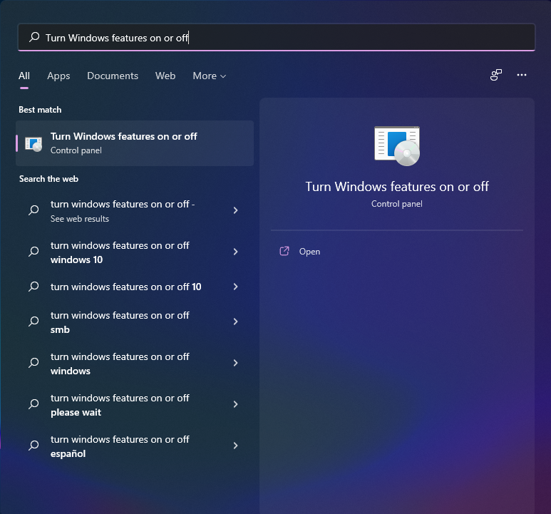
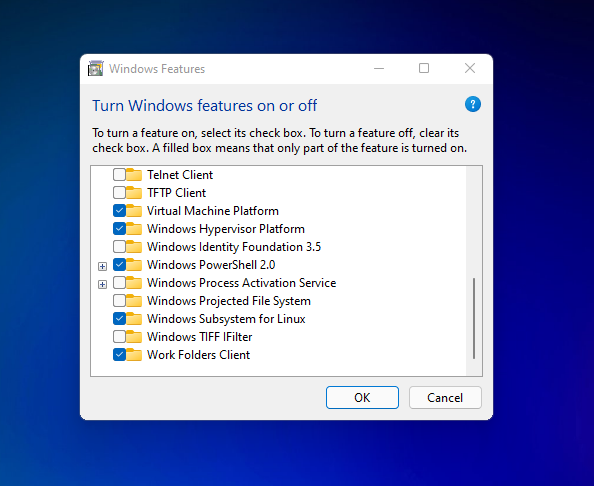
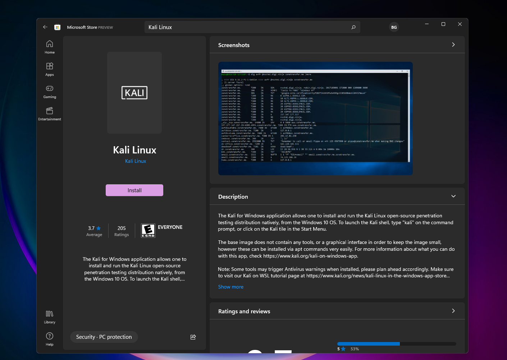
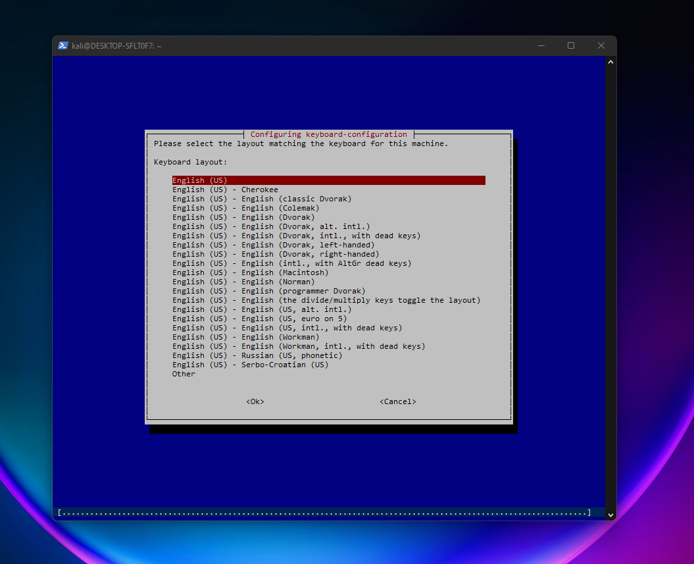
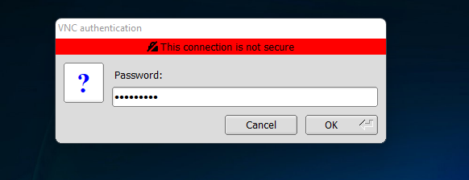

# WSL'de Kali Kurulumu
Bu dosyada WSL'in aktifleştirilmesi ve WSL ile Kali kurmayı öğreneceğiz.

<p align="left" style="vertical-align: top;">
  
</p>

<p align="center">
  <a href="#WSLin-Aktiflestirilmesi">WSL'in Aktifleştirilmesi</a>
  &nbsp;&nbsp;&nbsp;|&nbsp;&nbsp;&nbsp;
  <a href="#Kalinin-Kurulumu">Kali'nin Kurulumu</a>
  &nbsp;&nbsp;&nbsp;|&nbsp;&nbsp;&nbsp;
  <a href="#Kalinin-Masaüstü-Kurulumu">Kali'nin Masaüstü Kurulumu</a>
  &nbsp;&nbsp;&nbsp;|&nbsp;&nbsp;&nbsp;
  <a href="#Ekstralar">Ekstralar</a>
</p>


## WSLin-Aktiflestirilmesi

İlk olarak Windows tuşuna basıp "Windows özelliklerini aç veya kapat" ya da Windowsunuz İngilizceyse "Turn Windows features on or off" şeklinde aratıp ilk sonuca tıklayın



Daha sonra gelen ekranda Linux için Windows Alt Sistemi kutusunu ve Sanal Makina Platformu kutusunu işaretleyin ve tamama tıklayın.




Özellikler bilgisayara indikten sonra bilgisayarı yeniden başlatın ve <a href=https://wslstorestorage.blob.core.windows.net/wslblob/wsl_update_x64.msi>buraya</a> tıklayarak wsl2 kernelini indirip bilgisayarınıza kurun ve bilgisayarınızı tekrar yeniden başlatın.

Bilgisayarınızı yeniden başlattıktan sonra powershelli yönetici olarak açıp aşağıdaki komutu yazun.
```powershell
wsl --set-default-version 2
```
Ve komut çalıştıktan sonra aşağıdaki komutu yazın.
```powershell
wsl --update
```
Eğer bir güncelleme yaparsa güncellenmenin tamamlanması için aşağıdaki komutu yazın.
```powershell
wsl --shutdown
```

## Kalinin-Kurulumu

Micorosft Store'a girip Kali Linux diye aratın.



Yukarıdaki uygulamayı bulup indirin.

Uygulamayı indirip açtıktan sonra

```bash
Installing, this may take a few minutes...
```

yazısı ile karşılaşacaksınız ve işlem tamamlandıktan sonra sizden bir kullanıcı adı belirlemenizi isteyecek.
Kullanıcı adınızı belirleyin ve daha sonra çıkan ekranda şifrenizi belirleyin.

Bu işlemler bittikten sonra karşınıza kali terminali gelecek.

## Kalinin-Masaüstü-Kurulumu

İlk olarak sistemi güncelleyelim.
```bash
sudo apt update
sudo apt full-upgrade -y
```

Güncelleme bittikten sonra Win-Kex'i yani kali-win-kex paketini Kali'ye yükleyeceğiz.
```bash
sudo apt install kali-win-kex
```
Paket yüklenirken karşınıza "Configuring keyboard-configuration" ekranı gelecek.



Other'ı seçip daha sonra gelen ekranda Turkish gelene kadar aşağı ok tuşuna basıyoruz ve Turkish'i seçiyoruz.
Gelen ekrandan tekrar Turkish'i seçiyoruz ve kurulum devam ediyor.

Kurulum bittikten sonra terminal'e
```bash
kex
```
Komutunu kullanarak kex'i çalıştırın.

Şifre girmenizi isteyecek ve daha sonra "Would you like to enter a view-only password (y/n)? " yazısı çıkacak. n yazıp entera basın ve bu adımı atlayın. Daha sonra bağlantıyı yaparken aşağıdaki ekran gelecek oraya az önce belirlediğiniz şifreyi yazacaksınız.



Eğer hata alırsanız aşağıdaki komutları uygulayın:
```bash
sudo rm -rf /etc/.X11-unix
vncserver
```

Daha sonra kex'i tekrar çalıştırmayı deneyin ve büyük olasılıkla sorununuz çözülmüş olacak.


## Ekstralar

1- WSL'deki Kali'de root hesabının default olarak şifresi yok ve değiştirmek için aşağıdaki adımları uygulayabilirsiniz.
```bash
sudo su
passwd
```

2- WSL'deki Kali'de pentesting toolları kurulu olarak gelmiyor. Toolları kurmak için aşağıdaki komutu kullanabilirsiniz.
```bash
sudo apt install kali-linux-default
sudo apt install kali-tweaks
```
Daha sonra kali tweaks menüsüne girip oradan sisteminizde olmayan başka toolları da seçerek indirebilirsiniz.

3- Kali'yi root olarak kullanmayı seviyorsanız aşağıdaki komutu powershell'e yazarak kali açıldığında direk root hesabına giriş yapabilirsiniz
```powershell
kali config --default-user root
```
