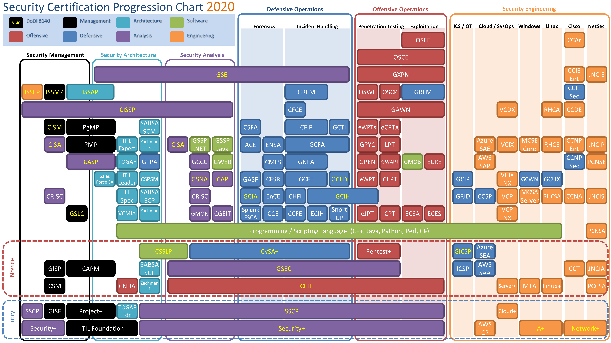

# Siber Guvenlik Dallari ve Sertifikalari   

* Yukari da, gunumuzde yaygin olarak yer alan siber guvenlik dallarini ve bu alanlarda etkin kullanilan sertifikalari gorebilirsiniz..
* Ayrica asagida ki link de, bunlarin tiklanabilir ve detayli bilgi alinabilir versinunu da ekliyorum.
https://lunizz.github.io/seccert.html

Yukari daki imaja geri donersek;
> ## Guvenlik yonetimi;
 > daha siklikla yonetim ve bilgi guvenligi denetimi alanlarinda calisarak, sirketlerin bilgi guvenligi regulasyonlarina uyumlulugunu test eden meslek  dali, burada onemli olan sertifikalar; CISSP, CISA, giris seviyesinde de Security+ ve ITIL...

> ## Guvenlik mimarisi;
> Daha ziyade, cozumlerin guvenli bir sekilde kurumsal ortama entegrasyonunu hazirlayan, isin surec ve dizayn asamasinda yer alan meslek dali. Normal sartlarda, diger alt kirilimlarini da kapsamakla birlikte, bazi durumlarda gerek kalmadan sadece genel bilgi ve siber guvenlik bilgisi ile birlikte, genel enterprise architecture bilgisi de yeterli olabilir. Burada ne kadar deneyimli oldugunuz, sizin katma degerinizi belirler.
Onemli sertifikalar; CISSP, TOGAF, SABSA, ITIL, programlama/urun/pentest bilgisi aranilan ozelliklerdendir.

> ## Risk Analisti (burada Guvenlik analisti diye gecmis ancak normalde bu sekilde adlandirmiyoruz)
> Risk register i olusturmak, sirketin risk seviyesini ve atak zeminini belirleme ile birlikte yonetilebilinir guvenlik incelemeleri ve varliklarin tanimlanmasi kismindan sorumludur, CySA+, CISA, CRISC onemli sertifikalaridir.

> ## Guvenlik analisti Mavi takim operasyonlari;
> Daha ziyade SOC ortaminda, mavi takim (blue team) seklinde adlandirdigimiz takimin uyelerindendir. Var olan kurumsal yapinin guvenliginin analizi, olan eksikliklerin tanimlanmasi, threat hunting, adli-bilisim, vaka incelemesi gibi islerle ugrasirlar. Sizma ve erisim denemelerini inceler, onlem alamaya calisirlar. Onemli Sertifikalari; CEH, Security+ ile baslar, GCIA, GASF, GCIH, CySA+, GSEC, Security+...

> ## Red-team, pentesterlar;
> Sirketin var olan varliklarinin zafiyet taramalari, sizma testlerinin yapilmasindan sorumlu bu ekibe, kirmizi ekip deniyor genellikle. Uyelerine de sizma testi uzmani. Onemli sertifikalari; CEH, Pentest+, Security+ giris seviyesinde iken, ileri seviyelerde, OSCP, OSWE, OSCE, OSEE, GXPN...

> ## Guvenlik muhendisleri;
> Geldik zurnanin zirt dedigi yere ;) Burasi biraz vahsi bati gibi, bu adamlar genellikle sistem entegratorlerinde, ureticilerde, distributorlerde calisirlar. Iki temel fonksiyonlari vardir, 
* satis oncesi, teknik sunum, POC yapimi ve Sartnameler ile urun demolari ile ugrasan pre-sales ekibi...
* satis sonrasi, kurulum, bakim, destek, profesyonel hizmetler ve danismanlik hizmetleri veren post-sales ekibi...
> Ureticiler ve bagli yetkinliklerine gore alt dallari olabilir ancak, yetkinliklerini ureticiler ve urun gamlari belirler genellikle. Onemli sertifikalari yine ureticilerin belirledigi, temel giris sertifikalarindan baslar, gelisen seviyelerine dogru degisir.
> Sanallastirma guvenliginden, OS guvenligine, Endpoint guvenliginden, cloud ve Ops guvenligine kadar bir cok yetkinlik dali olabilir. Bunlarin hepsinden biraz olabilecegi gibi, bir tanesinde "principal consultant" seviyesinde derin bilgisi de olabilir bu adamlarin.

Umarim begenmissinizdir, elimden geldigince acikladim.
Twitch deki yayinlara gelirseniz, bunlar uzerine sohbet etme ve varsa sorularinizi yanitlama firsati yakalayabiliriz.

https://twitch.tv/lunizz

Ayrica bununla ilgili bir video cekip youtube kanalima koymayi planliyorum yakin zamanda... koydugumda burayi guncellerim..

